# CLAUDE.md

This file provides guidance to Claude Code (claude.ai/code) when working with code in this repository.

## Build & Run

```bash
# Build
./mvnw clean package

# Run with Docker (PostgreSQL on port 5433)
docker-compose up -d

# Run application
./mvnw spring-boot:run

# Run tests
./mvnw test

# Run single test
./mvnw test -Dtest=ClassNameTest
```

## Architecture

**Spring Boot 4.0.1** + **Java 17** + **PostgreSQL** (port 5433) - REST API for POS/inventory management.

### Layer Structure
```
controller → service → repository
    ↓
  mapper/converter
    ↓
 domain/entity
    ↓
   model (DTOs, requests, responses)
```

### Key Packages
- `controller/` - REST endpoints (7 controllers: Product, Client, Category, Inventario, MovimientoInventario, TipoMovimiento, DetalleInventario)
- `service/` - Business logic (5 services)
- `repository/` - JPA repositories with Specification support for dynamic queries
- `domain/entity/` - JPA entities (40 tables in database, see Database section)
- `model/` - DTOs, request/response wrappers
- `mapper/` - Model mapping (ClientMapper, ProductMapper)

## Database

**PostgreSQL** via Docker Compose (`docker-compose.yml`) - 40 tables total.

### Connection Config
- URL: `jdbc:postgresql://localhost:5433/posdb`
- User: `posuser` / Password: `pospass`
- Schema: `public`
- HikariCP pool (max 10 connections)

### Database Files
- Initial seed data: `database/init.sql`
- Migrations: `database/migrations/`
- Full backup: `database/backup/dump-posdb-*.sql`
- Schema auto-update: `ddl-auto=update`

### Entity Relationship Diagram

```mermaid
erDiagram
    %% PRODUCTOS
    producto ||--o{ detalle_factura : "tiene"
    producto ||--o{ detalle_pedido : "tiene"
    producto ||--o{ detalle_inventario : "tiene"
    producto ||--o{ movimiento_inventario : "tiene"
    producto ||--o{ detalle_orden_compra : "tiene"
    producto ||--o{ historial_precio_producto : "tiene"
    producto ||--o{ producto_proveedor : "tiene"
    producto }o--|| categoria_producto : "pertenece"
    producto }o--|| unidad_medida : "usa"
    
    %% PROVEEDORES
    proveedor ||--o{ producto_proveedor : "provee"
    proveedor ||--o{ contacto_proveedor : "tiene"
    proveedor ||--o{ factura_compra : "recibe"
    proveedor ||--o{ orden_compra : "recibe"
    proveedor ||--o{ pago_proveedor : "recibe"
    
    %% CLIENTES
    cliente ||--o{ contacto_cliente : "tiene"
    cliente ||--o{ pedido : "realiza"
    cliente ||--o{ factura : "recibe"
    cliente }o--|| ciudad : "vive en"
    cliente }o--|| pais : "nacionalidad"
    
    %% EMPLEADOS
    empleado ||--o{ caja : "maneja"
    empleado ||--o{ inventario : "realiza"
    empleado ||--o{ pedido : "atiende"
    empleado ||--o{ orden_compra : "genera"
    empleado ||--o{ turno : "tiene"
    empleado }o--|| ciudad : "ubicado en"
    empleado }o--|| rol_empleado : "tiene"
    
    %% VENTAS
    pedido ||--o{ detalle_pedido : "contiene"
    pedido ||--o{ factura : "genera"
    factura ||--o{ detalle_factura : "contiene"
    
    %% COMPRAS
    orden_compra ||--o{ detalle_orden_compra : "contiene"
    factura_compra ||--o{ detalle_factura_compra : "contiene"
    
    %% INVENTARIO
    inventario ||--o{ detalle_inventario : "contiene"
    movimiento_inventario }o--|| tipo_movimiento : "clasifica"
    
    %% CAJA
    caja ||--o{ movimiento_caja : "tiene"
    movimiento_caja }o--|| tipo_movimiento_caja : "clasifica"
    
    %% SEGURIDAD
    usuario ||--o{ usuario_rol : "tiene"
    rol ||--o{ usuario_rol : "asigna"
    rol ||--o{ rol_permiso : "contiene"
    permiso ||--o{ rol_permiso : "contiene"
    
    %% GEOGRAFIA
    pais ||--o{ ciudad : "contiene"
    
    %% CATEGORIAS
    categoria_producto ||--o{ subcategoria_producto : "contiene"
```



### Tables by Module (40 total)

| Module | Tables |
|--------|--------|
| **Productos** | `producto`, `categoria_producto`, `subcategoria_producto`, `unidad_medida`, `producto_proveedor`, `historial_precio_producto` |
| **Proveedores** | `proveedor`, `contacto_proveedor` |
| **Clientes** | `cliente`, `contacto_cliente` |
| **Empleados** | `empleado`, `rol_empleado`, `turno` |
| **Ventas** | `pedido`, `detalle_pedido`, `factura`, `detalle_factura` |
| **Compras** | `orden_compra`, `detalle_orden_compra`, `factura_compra`, `detalle_factura_compra`, `pago_proveedor` |
| **Inventario** | `inventario`, `detalle_inventario`, `movimiento_inventario`, `tipo_movimiento` |
| **Caja** | `caja`, `movimiento_caja`, `tipo_movimiento_caja` |
| **Seguridad** | `usuario`, `rol`, `permiso`, `usuario_rol`, `rol_permiso` |
| **Geografía** | `pais`, `ciudad` |
| **Pagos** | `forma_pago` |
| **Auditoría** | `transferencia_informacion` |
| **Other** | `tablas` (empty), `tan` (empty) |

### Key Relationships

```
producto → categoria_producto, unidad_medida, producto_proveedor
cliente → ciudad, pais (nacionalidad)
empleado → ciudad, rol_empleado
pedido → cliente, empleado
factura → cliente, pedido
detalle_factura → factura, producto
inventario → empleado
detalle_inventario → inventario, producto
movimiento_inventario → producto, tipo_movimiento
caja → empleado
movimiento_caja → caja, tipo_movimiento_caja
usuario → usuario_rol → rol → rol_permiso → permiso
```

## API Access

- Server: `http://localhost:8081/@project.artifactId@`
- Swagger UI: `/swagger-ui.html`
- API Docs: `/api-docs`

## Notable Patterns

- `Producto` entity includes helper methods for stock operations (`incrementarStock`, `decrementarStock`, `tieneStock`)
- `PersonBaseEntity` base class for shared person fields (Cliente, Proveedor, Empleado)
- `@ToString`/`@EqualsAndHashCode` exclude lazy collections to prevent serialization issues
- Specification pattern for dynamic filtering (ProductSpecification, ClientSpecification, CategorySpecification)
- `producto_proveedor` enables many-to-many relationship between products and suppliers with cost tracking
